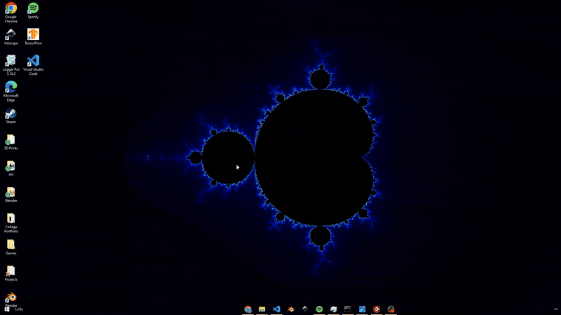

# Mandelbrot Fractal

Developed by underpig1 for the Octos app to demonstrate compatibility with WebAssembly apps.

### Technical details

This app is built with C++ WebAssembly for native-speed computation and uses Web Workers for tile parallelization. It has a 64-bit scale precision limit.

- C++ WebAssembly
    - Uses Emscripten to compile native C++ methods to WASM
    - Exposes WASM methods to JS
    - Allows optimized native-speed computation

- Web Workers
    - Allows parallelization of tile-based computations

- Escape-time algorithm
    - Standard Mandelbrot iteration formula

- Cardioid/bulb check
    - Algorithm to check if a point is inside the main cardioid or period-2 bulb of the Mandelbrot set.
    - Points inside these regions are guaranteed to be in the set → no iterations needed.
    - Saves significant computation time

- Smooth coloring
    - Computes fractional iteration count for continuous coloring instead of discrete banding

- Contiguous image buffer
    - Uses Emscripten to expose a shared data buffer between JS and WASM
    - Prevents overhead due to high-res image copies